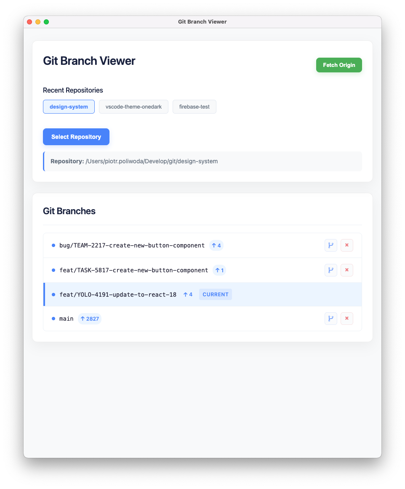

# Git branch viewer

A simple Electron app to view Git branches. Keep your branches clean with Git branch viewer.
Fetch all branches and see the commit count for each branch.
See the amount of commits on each branch. Checkout to any branch.
Delete branches that are not needed.

## Screenshot



## Installation

```bash
npm install
```

## Usage

```bash
npm run build
```

## License

MIT
